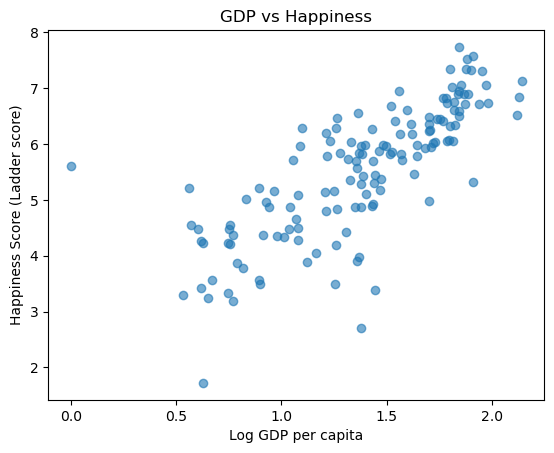

Exploratory Data Analysis of World Happiness report

The dataset was sourced from (https://www.kaggle.com/datasets/jainaru/world-happiness-report-2024-yearly-updated)

About Dataset
Context:

The World Happiness Report is a landmark survey of the state of global happiness . The report continues to gain global recognition as governments, organizations and civil society increasingly use happiness indicators to inform their policy-making decisions. Leading experts across fields – economics, psychology, survey analysis, national statistics, health, public policy and more – describe how measurements of well-being can be used effectively to assess the progress of nations. The reports review the state of happiness in the world today and show how the new science of happiness explains personal and national variations in happiness.

Content:

Country name: Name of the country.
Regional indicator: Region to which the country belongs.
Ladder score: The happiness score for each country, based on responses to the Cantril Ladder question that asks respondents to think of a ladder, with the best possible life for them being a 10, and the worst possible life being a 0.
Upper whisker: Upper bound of the happiness score.
Lower whisker: Lower bound of the happiness score.
Log GDP per capita: The natural logarithm of the country's GDP per capita, adjusted for purchasing power parity (PPP) to account for differences in the cost of living between countries.
Social support: The national average of binary responses(either 0 or 1 representing No/Yes) to the question about having relatives or friends to count on in times of trouble.
Healthy life expectancy: The average number of years a newborn infant would live in good health, based on mortality rates and life expectancy at different ages.
Freedom to make life choices: The national average of responses to the question about satisfaction with freedom to choose what to do with one's life.
Generosity: The residual of regressing the national average of responses to the question about donating money to charity on GDP per capita.

Tools & Libraries Used

Python
Pandas & NumPy for data manipulation and numerical analysis.
Matplotlib for data visualization.
Scikit-learn for data preprocessing (e.g., scaling,catagorical transformation).

Key Findings & Visualizations

* There is a strong positive correlation between a country's GDP per capita and its overall happiness score.
* Social support and healthy life expectancy are also significant predictors of happiness.

